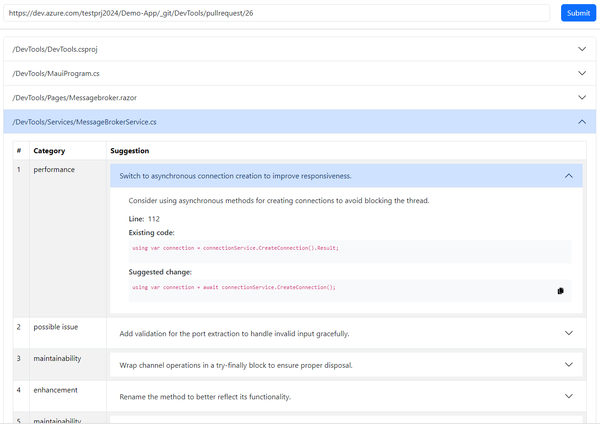

# PR Code Suggestion

An AI-Powered web application that provides code suggestions and improvements for pull requests on Azure DevOps. 
It uses a combination of ASP.NET Core for the backend API and React for the frontend user interface.

## Project Structure

The project consists of two main parts:

1. WebApi: An ASP.NET Core application that handles the backend logic.
2. WebApp: A React application that provides the user interface.

## Features

- Code suggestion generation for pull requests via Azure OpenAI service
- Real-time updates using SignalR
- File validation and caching
- Support for C#, React + TS and SQL script



## Technologies Used

### Backend (WebApi)
- ASP.NET Core 8.0
- SignalR for real-time communication
- LiteDB for local data storage
- Serilog for logging
- FluentResults for result handling
- [Microsoft Semantic Kernel](https://github.com/microsoft/semantic-kernel) for AI orchestration and prompt management

### Frontend (WebApp)
- React 18
- TypeScript
- Vite for build tooling
- TanStack Router for routing
- React Bootstrap for UI components

## Getting Started

### Prerequisites
- .NET 8.0 SDK
- Node.js (version 18.x or later)
- pnpm package manager

### Setup

1. Clone the repository
2. Navigate to the WebApi directory and create a file named `privatesettings.json` with the following content:
   ```json
   {
     "AZURE_DEVOPS_ORG": "",
     "AZURE_DEVOPS_PAT": "",
     "AZURE_OPENAI_ENDPOINT": "",
     "AZURE_OPENAI_KEY": "",
     "AZURE_OPENAI_DEPLOYMENT": ""
   }
   ```
   Fill in the appropriate values for your Azure DevOps organization and Azure OpenAI service.
3. In the WebApi directory, run:
   ```
   dotnet restore
   dotnet build
   ```
4. Navigate to the WebApp directory and run:
   ```
   pnpm install
   ```

### Running the Application

1. Start the WebApi:
   ```
   cd WebApi
   dotnet run
   ```
2. In a separate terminal, start the WebApp:
   ```
   cd WebApp
   pnpm run dev
   ```

The application should now be running on `http://localhost:18103` with the API accessible at `http://localhost:18102`.

## Configuration

- WebApi configuration can be found in `appsettings.json` and `privatesettings.json`
- WebApp configuration can be adjusted in `vite.config.ts`

## Acknowledgements

This project is inspired by the awesome [PR-Agent project](https://github.com/Codium-ai/pr-agent) by CodiumAI. 
We extend our gratitude to the CodiumAI team for their innovative work in the field of AI-powered code review and pull request analysis. 
While our implementation is tailored for Azure DevOps and uses different technologies, the core concept and many features are influenced by PR-Agent's capabilities.

## License

This project is licensed under the [MIT License](LICENSE).
